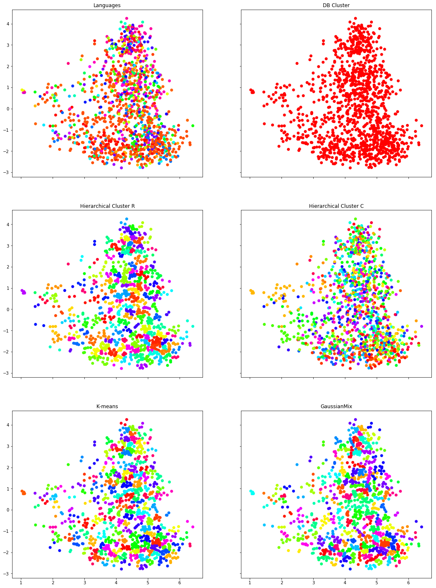

# Cultural Algebra

This is an attemp to apply some algebra concepts to cultural studies.

This project uses the [Murdock Ethnographic Atlas Data set](https://d-place.org/contributions/EA) as a description of each cultures and turn to create a algebraic multi-dimensional space, where is culture is represented a as vector of all their political, economic, kinship, etc. to calculate similarity among cultures as teh cosine distance between vectors.

To see the whole analysis in detail, please click on [Full Cultural Algebra analysis](https://nbviewer.jupyter.org/github/anankeman/Cultural-Algebra/blob/master/cultural%20similarity.ipynb)

## TDLR

- Load an clean datasets
- Apply `one hot encoding` to categorical variables
- Merge with ordinal and numeric variables
- Normalize values
- Create a sparce matrix of Cosine distance values between ethnic groups
- Use the matrix to get the most similar cultures
- Use the matrix to build a graph model, where close cultures create links between them
- Apply dimensionality reduction to visualy map the cultural space usin `Tsne` and `PCA`
- Use clustering algorithms to try to group ethnic groups
- Compare cluster with family and geographical relations

Sample of dimensional space and cluster strategies

## Author

@[Pippo Ramos](https://github.com/pippo-sci)

## Tech Stack

- Python 3.8
- Jupyter notebook
- Pandas
- Numpy
- Scklearn
- NetworkX
